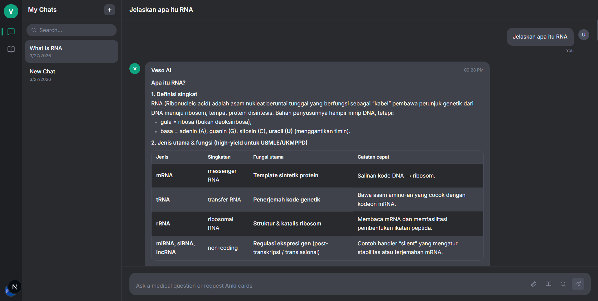
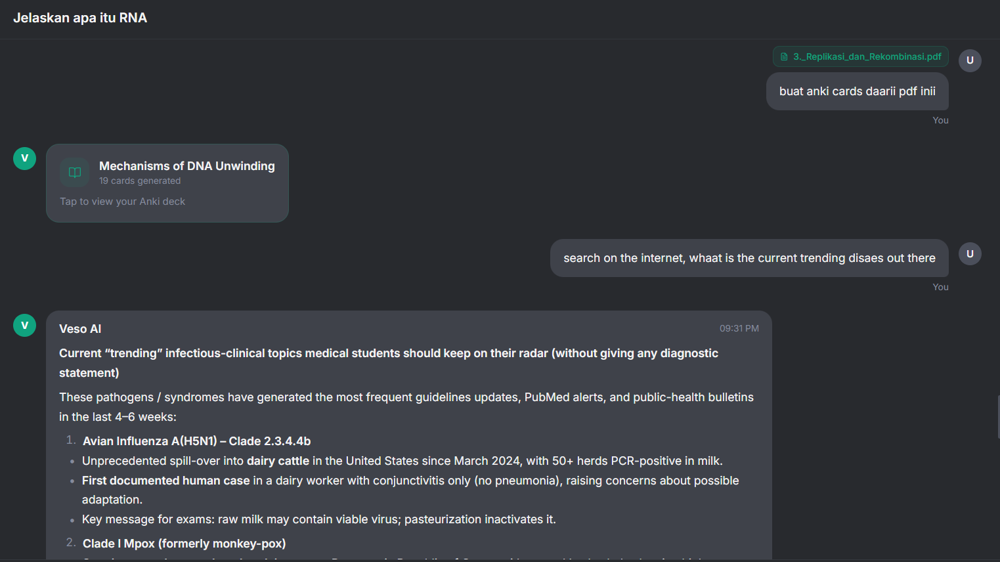
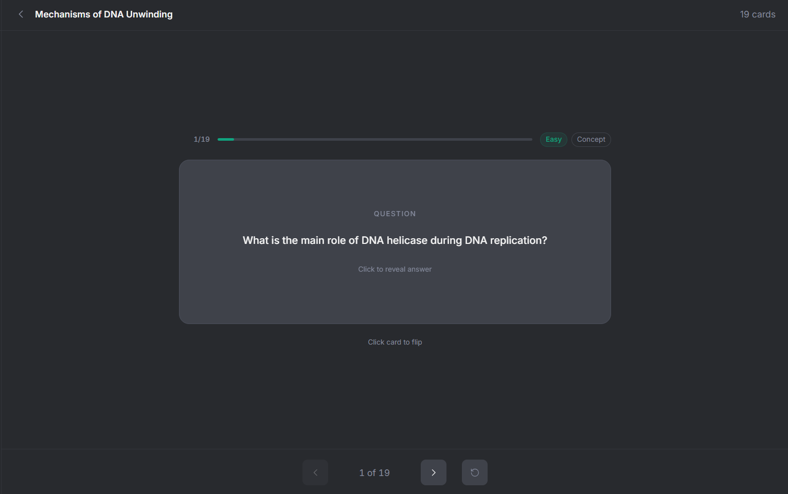
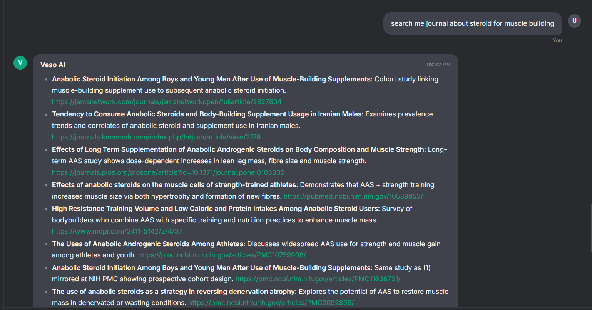

# Veso AI

**An AI-powered medical study assistant built for USMLE and PLAB students.**

Veso AI combines a reasoning large language model, retrieval-augmented generation, real-time web search, and intelligent Anki flashcard generation into a single, fast, streaming chat interface — purpose-built for the way medical students actually study.

---

## Screenshots

### Conversational Medical AI
Ask complex questions and get structured, exam-focused answers with markdown rendering — bold, tables, headings, and code blocks all rendered natively.



### Live Web Search with Real Citations
Toggle web search to ground any answer in the latest guidelines, studies, and PubMed papers — with clickable source links returned alongside every response.



### Anki Flashcard Generation from PDFs
Attach any PDF or study note, and Veso AI generates 15–25 high-yield Anki cards across three types (concept, conceptual, clinical) and three difficulty levels — with the deck title derived intelligently from the file content, not your prompt.



### PubMed & Academic Journal Search
Searches targeting journals or studies automatically query PubMed, PMC, and ResearchGate directly — returning real paper titles and live URLs, not invented DOIs.



---

## What Makes Veso AI Different

**Powered by Kimi-K2-Instruct** — a frontier reasoning model via NVIDIA NIM, accessed through LangChain's NVIDIA AI Endpoints. Kimi-K2-Instruct is a 1-trillion-parameter mixture-of-experts model that produces detailed, structured medical explanations at a level that matches or exceeds general-purpose models on knowledge-heavy tasks.

**File-aware RAG, not generic semantic search** — when you attach a PDF, Veso AI retrieves content specifically from that file using source-filtered ChromaDB lookups, bypassing semantic search entirely. Queries like "explain this PDF" match exactly zero medical content chunks semantically — file-anchored retrieval solves this.

**Real web search with academic source targeting** — powered by Tavily's AI-optimised search API. Journal queries automatically route to PubMed, PMC, and ResearchGate with domain filtering, returning real paper URLs rather than fabricated DOIs.

**Streaming everything** — chat responses, document summaries, and search answers all stream token-by-token over Server-Sent Events with a custom SSE parser built on the native `ReadableStream` API (no `EventSource` — it can't send `Authorization` headers).

**Anki cards that are actually good** — 15–25 cards per deck, evenly mixed across concept / conceptual / clinical types and easy / medium / hard difficulty levels. Clinical statements use cautious phrasing by convention. The LLM output goes through a sanitisation pipeline that strips cloze syntax, section markers, and other artefacts before any card is saved.

**Anki from inside chat** — generate a deck mid-conversation without leaving the chat. The deck card appears inline and persists across reloads via a structured metadata pattern on the message record.

**Secure by design** — path traversal prevention on file uploads, 20 MB upload cap, per-user data scoping on every query, conversation ownership checks before any data access, anchored CORS regex, prompt injection detection, and user input delimiters in every LLM call.

---

## Tech Stack

| Layer | Technology |
|---|---|
| Frontend | Next.js 16.2.1 (App Router), TypeScript, Tailwind CSS v4 |
| Animation | Framer Motion v12 |
| Auth | NextAuth.js v5 beta — Google OAuth, sliding 30-day session with auto-refresh |
| Backend | FastAPI 0.111, Python 3.11, streaming SSE |
| LLM | `moonshotai/kimi-k2-instruct` via NVIDIA NIM — LangChain NVIDIA AI Endpoints |
| RAG | ChromaDB + `sentence-transformers/all-MiniLM-L6-v2` (CPU, no API key) |
| Web Search | Tavily Search API (AI-optimised) + DuckDuckGo fallback |
| Database | Supabase (Postgres) — conversations, messages, Anki decks and cards |
| Deployment | Vercel (frontend) + Railway (backend, Docker) |

---

## Features

- **Streaming chat** — token-by-token SSE with rolling 12-message context window; follow-up questions always resolve correctly
- **Web search** — Tavily-powered with automatic academic source routing for journal/study queries; cited sources rendered as a clickable panel
- **RAG** — knowledge-base files chunked at 600 tokens, embedded, stored in ChromaDB; semantic retrieval for general questions, source-filtered retrieval when a file is attached
- **File upload** — attach PDF or TXT to any message; content is ingested into ChromaDB and retrieved directly from that file for the current request
- **Anki generation** — from topic, uploaded file, knowledge base, web search, or any combination; 15–25 cards, three types, three difficulty levels
- **Inline Anki from chat** — generate a deck mid-conversation; deck card persists in chat history across reloads
- **Auto-generated titles** — conversations and decks are titled automatically via a short LLM call; file-attached Anki decks derive their title from the document content, not the user's meta-instruction
- **Markdown rendering** — bold, headings, numbered/bulleted lists, tables, code blocks — implemented without `react-markdown`
- **Responsive layout** — three-column shell (icon rail, chat list, main) collapses to a slide-over sidebar on mobile
- **Prompt injection defence** — regex detection of jailbreak patterns short-circuits the LLM call before any tokens are generated

---

## Running Locally

### Prerequisites

- Node.js 18+
- Python 3.11 (specifically — pinned dependencies require 3.11 wheels)
- A [Supabase](https://supabase.com) project
- A Google OAuth app (Client ID + Secret)
- An [NVIDIA NIM](https://build.nvidia.com) API key
- A [Tavily](https://app.tavily.com) API key (free, 1000 searches/month)

### Backend

```bash
cd backend

# Python 3.11 venv is required
"C:\Users\...\Python311\python.exe" -m venv .venv
.venv\Scripts\activate          # Windows
# source .venv/bin/activate     # Mac/Linux

pip install -r requirements.txt

cp .env.example .env
# fill in .env
```

**`backend/.env`**
```
NVIDIA_API_KEY=nvapi-...
SUPABASE_URL=https://xxx.supabase.co
SUPABASE_SERVICE_KEY=eyJ...
NEXTJS_URL=http://localhost:3000
NEXTAUTH_SECRET=<openssl rand -base64 32>
ENVIRONMENT=development
TAVILY_API_KEY=tvly-...
```

```bash
python -m uvicorn app.main:app --reload
# → http://localhost:8000
```

### Frontend

```bash
cd frontend
cp .env.local.example .env.local
npm install
npm run dev
# → http://localhost:3000
```

**`frontend/.env.local`**
```
NEXTAUTH_URL=http://localhost:3000
NEXTAUTH_SECRET=<same value as backend>
GOOGLE_CLIENT_ID=...
GOOGLE_CLIENT_SECRET=...
NEXT_PUBLIC_API_URL=http://localhost:8000
```

### Database (Supabase SQL Editor)

```sql
create table conversations (
  id uuid primary key default gen_random_uuid(),
  user_id text not null,
  title text not null default 'New Chat',
  created_at timestamptz default now(),
  updated_at timestamptz default now()
);

create table messages (
  id uuid primary key default gen_random_uuid(),
  conversation_id uuid references conversations(id) on delete cascade,
  role text not null check (role in ('user', 'assistant')),
  content text not null default '',
  metadata jsonb not null default '{}',
  created_at timestamptz default now()
);

create table anki_decks (
  id uuid primary key default gen_random_uuid(),
  user_id text not null,
  title text not null,
  topic text,
  card_count int not null default 0,
  created_at timestamptz default now()
);

create table anki_cards (
  id uuid primary key default gen_random_uuid(),
  deck_id uuid references anki_decks(id) on delete cascade,
  user_id text not null,
  front text not null,
  back text not null,
  difficulty text not null check (difficulty in ('easy', 'medium', 'hard')),
  card_type text not null check (card_type in ('concept', 'conceptual', 'clinical')),
  position int not null default 0
);

alter table conversations enable row level security;
alter table messages enable row level security;
alter table anki_decks enable row level security;
alter table anki_cards enable row level security;
```

### Optional: Seed the Knowledge Base

Drop `.txt` or `.pdf` medical textbooks into `backend/knowledge_base/`, then call:

```bash
curl -X POST http://localhost:8000/api/rag/ingest \
  -H "Authorization: Bearer <your-google-access-token>"
```

---

## Deployment

Full guide: [`docs/DEPLOYMENT.md`](docs/DEPLOYMENT.md)

| Layer | Platform |
|---|---|
| Backend | Railway (~$5/mo Hobby) — Docker, 24/7 uptime, auto-deploy on push |
| Frontend | Vercel (free) — auto-deploy on push |

---

## API Reference

| Method | Path | Auth | Description |
|---|---|---|---|
| GET | `/api/health` | No | Health check |
| GET | `/api/me` | Yes | Current user info |
| GET | `/api/chat/conversations` | Yes | List conversations |
| GET | `/api/chat/conversations/{id}/messages` | Yes | Get messages (ownership verified) |
| DELETE | `/api/chat/conversations/{id}` | Yes | Delete conversation |
| POST | `/api/chat/stream` | Yes | SSE streaming chat |
| POST | `/api/anki/generate` | Yes | Generate Anki deck |
| GET | `/api/anki/decks` | Yes | List decks |
| GET | `/api/anki/decks/{id}/cards` | Yes | Get cards (ownership verified) |
| DELETE | `/api/anki/decks/{id}` | Yes | Delete deck |
| POST | `/api/pdf/upload` | Yes | Upload file → ingest to ChromaDB |
| POST | `/api/pdf/summarize` | Yes | Upload file → SSE summary |
| POST | `/api/rag/ingest` | Yes | Ingest knowledge_base/ files |
| GET | `/api/rag/status` | Yes | ChromaDB chunk count + file list |

SSE event format (`/api/chat/stream` and `/api/pdf/summarize`):
```
data: {"type": "meta", "conversation_id": "uuid"}
data: {"type": "token", "content": "..."}
data: {"type": "sources", "sources": [...]}
data: {"type": "error", "message": "..."}
data: {"type": "done", "conversation_id": "uuid"}
```
